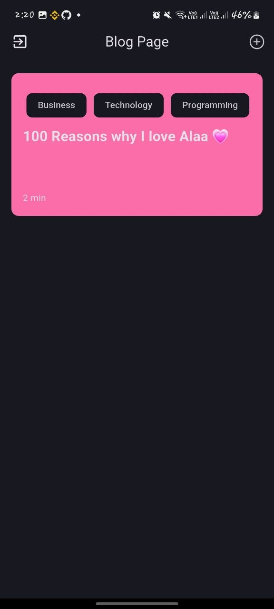
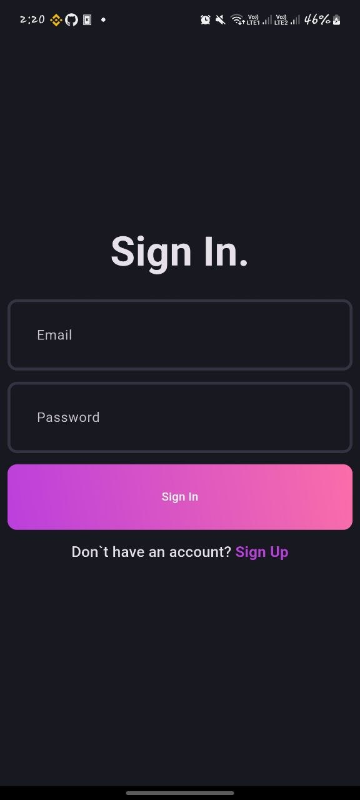
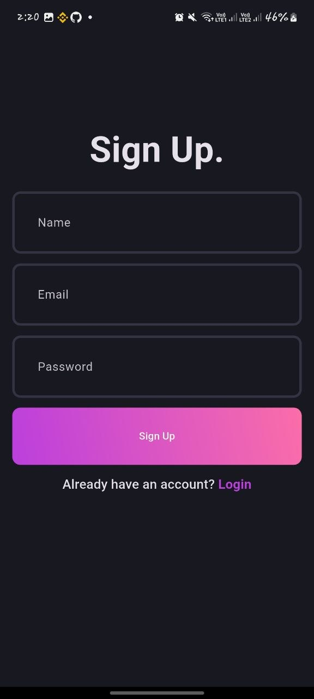
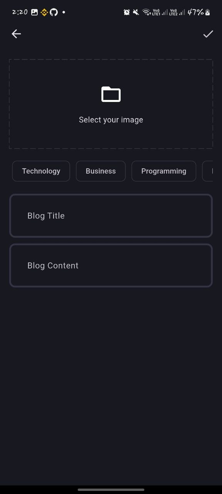

# 📝 Blog App

A modern **Flutter Blog Application** built with **Clean Architecture** and **BLoC**, with **GetIt** for dependency injection and **Hive** for local storage.

## ✨ Features

* 🔐 **Authentication**

  * Sign Up
  * Sign In
  * Persistent user session

* 📰 **Blog**

  * View all blogs
  * Add new blogs
  * Blog image upload
  * Blog content and details

* 💾 **Local Storage**

  * Hive for storing local user/session data

* ⚡ **State Management**

  * BLoC pattern

* 🏗 **Architecture**

  * Clean Architecture
  * Repository Pattern
  * Use Cases
  * Dependency Injection

## 🛠 Tech Stack

| Technology         | Usage                      |
| ------------------ | -------------------------- |
| Flutter            | UI & Application Framework |
| Dart               | Programming Language       |
| BLoC               | State Management           |
| GetIt              | Dependency Injection       |
| Hive               | Local Storage              |
| Supabase           | Authentication & Backend   |
| Clean Architecture | Project Architecture       |

## 📱 App Screens

| Home | Login | SignUp | AddBlog |
|------|-------|--------| ------- |
|  |  |  | 

### 🔑 Authentication

**Sign In**

Users can securely sign in using their account credentials.

**Sign Up**

New users can create an account and start using the application.

### 📰 Blog Page

The main blog page displays available blogs and their content.

### ➕ Add Blog Page

Users can create a new blog by adding:

* Blog title
* Blog content
* Blog image

## 🏛️ Clean Architecture

The project is divided into three main layers:

```text
Presentation
     ↓
Domain
     ↓
Data
```

### Presentation Layer

Contains:

* Pages
* Widgets
* BLoCs
* UI states and events

### Domain Layer

Contains:

* Entities
* Repository contracts
* Use Cases

### Data Layer

Contains:

* Models
* Data Sources
* Repository implementations

## 📂 Project Structure

```text
lib/
│
├── core/
│   ├── common/
│   ├── error/
│   ├── theme/
|   ├── utils/
|   ├── network/
│   └── usecase/
│    
├── features/
│   ├── auth/
│   │   ├── data/
│   │   ├── domain/
│   │   └── presentation/
│   │
│   └── blog/
│       ├── data/
│       ├── domain/
│       └── presentation/
│
├── init_dependencies.dart
└── main.dart
```

## 💉 Dependency Injection

**GetIt** is used to manage dependencies and keep the application loosely coupled.

Dependencies are registered during application initialization and injected where needed.

## 💾 Hive

**Hive** is used for local data persistence, including storing data needed to maintain the user's session locally.

## 🔄 BLoC

BLoC is responsible for managing application state and separating business logic from the UI.

The main flows include:

```text
User Action
     ↓
BLoC Event
     ↓
Use Case
     ↓
Repository
     ↓
Data Source
     ↓
BLoC State
     ↓
UI
```

Feel free to fork the repository and submit a pull request.

## 📄 License

This project is available under the **MIT License**.
